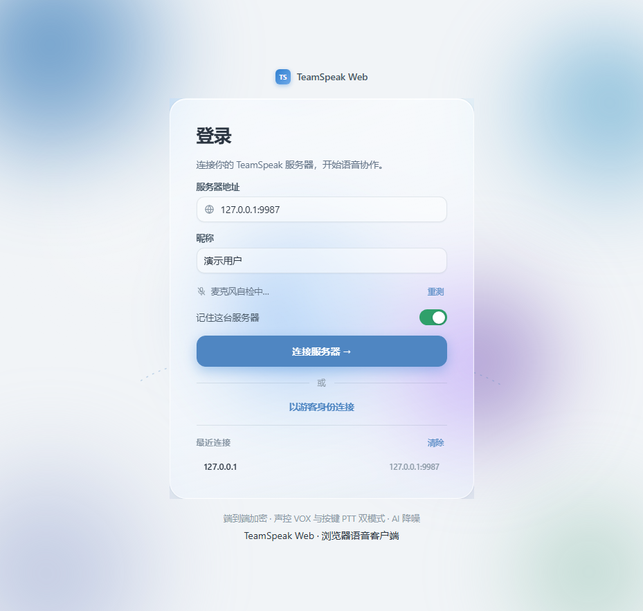
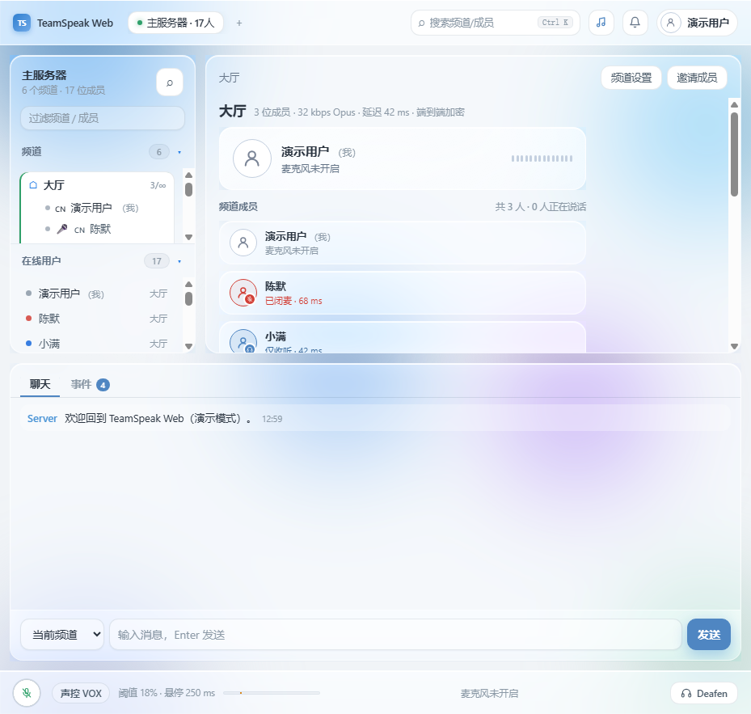
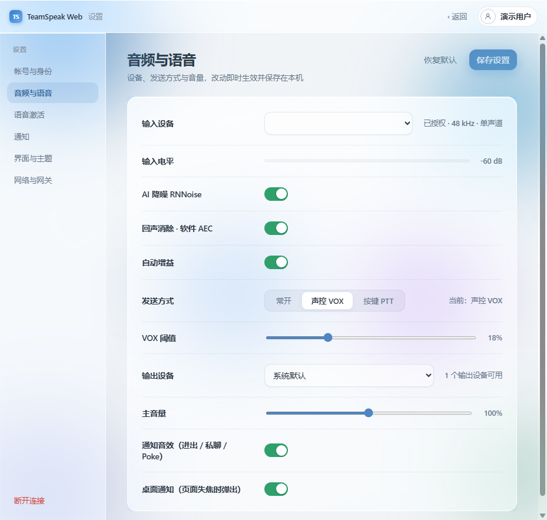

# TeamSpeak Web

> 浏览器里的 TeamSpeak 3 语音客户端 —— 打开网页即可连麦，无需安装任何客户端软件。

<div align="center">


</div>

TeamSpeak Web 通过一个轻量的 **Node.js WebSocket 网关**桥接 TeamSpeak 3 服务器，前端是 React 19 + TypeScript 的单页应用：**用户只要打开网址，就能连接任意 TS3 服务器**，支持文字聊天、语音通话（WebCodecs Opus）、声控 VOX / 按键 PTT、频道管理、成员右键菜单等完整功能。

界面采用 Figma 高保真设计稿还原：浅灰白底 + 雾蓝渐变晕染背景 + **轻磨砂玻璃卡片**，柔和阴影、圆角控件、充足留白，2D 平面 UI 风格（非 Discord 风格、非深色模式）。背景为**动态晕染**（渐变慢速流动 + 光斑漂移，支持系统"减弱动态效果"）。

---

## ✨ 特性

| 类别 | 能力 |
|------|------|
| 🔊 语音 | WebCodecs Opus 编解码、声控 VOX（**RNNoise VAD 智能门控**，抗键盘/风扇误触发）/ 常开 / 按键 PTT（默认空格）、**软件回声消除（FDAF+NLMS，HOP 128 ≈ 2.7ms 低延迟）**、**自动增益（DynamicsCompressor）**、**AI 降噪（RNNoise，10ms 帧实时抑制稳态噪声）**、麦克风自动识别与电平、输出设备选择 |
| 🖥️ 界面 | 浅色玻璃拟态 UI（浅灰白底、雾蓝渐变、轻磨砂卡片、柔和阴影）、3 栏工作台、圆角控件、毛玻璃背景光斑、**动态背景**（渐变慢速流动 + 光斑漂移，尊重"减弱动态效果"） |
| 📱 多端 | **响应式布局**：手机端底部导航（频道 / 语音 / 聊天）单面板切换、≥44px 触控目标、刘海屏安全区适配；平板 / 桌面自动回归 2~3 栏工作台 |

| 💬 聊天 | 频道消息 / 服务器消息 / 私聊、事件流（进入 / 离开 / 移动 / 连接）、系统通知音效、桌面通知 |
| 🏷️ 频道 | 频道树按 `channel_order` 排序、可折叠、双击加入、游客接待等权限约束 |
| 👥 成员 | 说话 / 闭麦 / 仅收听三态图标、国家旗、按成员音量记忆（0–150%）、右键菜单：私聊 / Poke / 耳语 / 复制昵称 / 快捷音量 |
| 🖥️ 多开 | 顶栏多服务器标签，仅活动标签上行麦克风 |
| 🔐 安全 | WS 帧载荷上限、并发连接数上限、可选的网关访问令牌（`GATEWAY_TOKEN`） |
| 🛡️ 健壮 | 断线自动重连、防重连风暴、mock 定时器防泄漏、二进制帧防御、ESLint + Vitest 质量门 |
| 🎵 音乐 | **音乐机器人集成（TSMusicBot）**：内置控制面板——搜索 / 点歌（网易云·QQ·酷狗·B站·YouTube·Jellyfin·Spotify）、播放控制 / 音量 / 播放模式、播放队列、歌词滚动、多机器人切换；网关 `/music` 同源反向代理（REST + WebSocket），免 CORS

---

## 🏗️ 架构

```
┌────────────────────────────────────────────────────────┐
│                      浏览器 (任意平台)                   │
│   React 19 SPA · 毛玻璃 UI · WebCodecs Opus 收发        │
│         │                                               │
│         │  WebSocket（JSON 控制消息 + Binary 音频帧）     │
└─────────┼──────────────────────────────────────────────┘
          ▼
┌────────────────────────────────────────────────────────┐
│                Node.js 网关（Windows / Linux / Docker） │
│   · 静态托管 dist/（HTTP）                               │
│   · /ws WebSocket 会话：帧防御 · 连接数上限 · maxPayload │
│   · ts3-adapter：真实 TS3 客户端协议                     │
└─────────┼──────────────────────────────────────────────┘
          │ UDP（默认 9987，ECDH/RSA/EAX 加密握手）
          ▼
┌────────────────────────────────────────────────────────┐
│               TeamSpeak 3 Server（你的服务器）           │
└────────────────────────────────────────────────────────┘
```

浏览器无法直接使用 TeamSpeak 3 的 **UDP + 专有加密协议**，因此网关是必须的一环：它负责 UDP 握手、加密、语音帧转发，浏览器只通过 WebSocket 与网关通信。

**Mock 模式**（`PROTOCOL=mock`）：无需真实服务器即可体验全部 UI 功能，内置一套中文演示数据（6 频道 / 17 成员），适合开发调试与演示。

---

## 📸 界面预览

| 登录页 | 主界面 | 设置页 |
|--------|--------|--------|
|  |  |  |

> 截图对应 `PROTOCOL=mock` 演示模式下的完整界面：登录 → 频道树 / 成员三态 / 聊天事件 → 音频与语音、帐号与身份设置。

---

## 🚀 快速开始（Docker，1 分钟）

```bash
git clone https://github.com/Funvvell/teamspeak-web.git
cd teamspeak-web
docker compose up -d --build
# 浏览器访问 http://<服务器IP>:8080
```

默认监听 `0.0.0.0:8080`，协议为真实 TS3（`PROTOCOL=ts3`）。TS3 身份持久化在 volume `tsweb-data`。

---

## 📦 安装部署

### 方式 A：Docker Compose（推荐，Linux / Windows Server 通用）

```bash
git clone https://github.com/Funvvell/teamspeak-web.git
cd teamspeak-web
docker compose up -d --build
```

| 项 | 说明 |
|----|------|
| 前置 | Docker Engine 20.10+（Windows Server 2019+/2022 启用 WSL2 或 Hyper-V 容器） |
| 端口 | 8080/TCP（Web + WS），出站 UDP 9987（连 TS3） |
| 数据 | TS 身份存储在 Docker volume `tsweb-data`，重建容器不丢失 |
| 日志 | `docker compose logs -f` |

常用运维命令：

```bash
docker compose down          # 停止
docker compose up -d         # 重新启动
docker compose pull && docker compose up -d --build   # 升级
```

### 方式 B：Windows Server 手动部署（Node.js + NSSM 开机自启）

1. **安装 Node.js 22 LTS**（PowerShell，管理员）：

   ```powershell
   winget install OpenJS.NodeJS.LTS
   # 或到 https://nodejs.org 下载 LTS 安装包
   ```

2. **获取代码并构建**：

   ```powershell
   git clone https://github.com/Funvvell/teamspeak-web.git
   cd teamspeak-web
   npm ci
   npm run build
   ```

3. **注册为 Windows 服务（NSSM 实现开机自启）**：

   下载 [NSSM](https://nssm.cc/download) 解压到 `C:\nssm`，然后以管理员运行：

   ```powershell
   cd C:\nssm
   .\nssm.exe install TeamSpeakWeb "C:\Program Files\nodejs\node.exe" "C:\teamspeak-web\node_modules\tsx\dist\cli.mjs gateway\src\index.ts"
   .\nssm.exe set TeamSpeakWeb AppDirectory C:\teamspeak-web
   .\nssm.exe set TeamSpeakWeb AppEnvironmentExtra PROTOCOL=ts3 PORT=8080 HOST=0.0.0.0
   .\nssm.exe set TeamSpeakWeb Start SERVICE_AUTO_START
   .\nssm.exe start TeamSpeakWeb
   ```

   > 说明：`npm start` 实际执行 `tsx gateway/src/index.ts`，NSSM 直接调用 `tsx` 的 CLI 入口，避免依赖 npm 脚本环境。

4. **放行防火墙**（管理员 PowerShell）：

   ```powershell
   netsh advfirewall firewall add rule name="TeamSpeakWeb HTTP" dir=in action=allow protocol=TCP localport=8080
   # 出站 UDP 9987 默认放行；若服务器出站受限请同样放行
   ```

5. **验证**：浏览器打开 `http://<服务器IP>:8080/health`，应返回 `{"ok":true,"protocol":"ts3",...}`。

### 方式 C：Linux 手动部署（systemd）

```bash
# 1. 安装 Node.js 22（Ubuntu/Debian 示例）
curl -fsSL https://deb.nodesource.com/setup_22.x | sudo -E bash -
sudo apt install -y nodejs

# 2. 部署到 /opt/teamspeak-web
sudo mkdir -p /opt/teamspeak-web
sudo rsync -a --exclude node_modules --exclude dist ./ /opt/teamspeak-web/
cd /opt/teamspeak-web
sudo npm ci
sudo npm run build

# 3. 安装 systemd 服务并启用
sudo cp deploy/teamspeak-web.service /etc/systemd/system/
sudo systemctl daemon-reload
sudo systemctl enable --now teamspeak-web
sudo systemctl status teamspeak-web

# 4. 防火墙（Ubuntu 示例）
sudo ufw allow 8080/tcp
```

### 🔐 HTTPS 与反向代理（生产必做）

浏览器**只有在安全上下文（HTTPS 或 localhost）下才允许使用麦克风**（`getUserMedia` / WebCodecs）。公网部署必须上 HTTPS：

1. 域名 A 记录指向服务器；
2. Nginx 反代本机 `8080`，并正确转发 WebSocket（`/ws` 的 `Upgrade` / `Connection` 头）；
3. Let's Encrypt 签发证书。

参考配置见 `deploy/nginx.conf.example`，关键片段：

```nginx
server {
    listen 443 ssl;
    server_name ts.example.com;
    ssl_certificate     /etc/letsencrypt/live/ts.example.com/fullchain.pem;
    ssl_certificate_key /etc/letsencrypt/live/ts.example.com/privkey.pem;

    location / {
        proxy_pass http://127.0.0.1:8080;
        proxy_set_header Host $host;
        proxy_set_header X-Real-IP $remote_addr;
    }
    location /ws {
        proxy_pass http://127.0.0.1:8080;
        proxy_http_version 1.1;
        proxy_set_header Upgrade $http_upgrade;
        proxy_set_header Connection "upgrade";
        proxy_read_timeout 3600s;
    }
}
```

用户访问 `https://ts.example.com` 即可开麦说话。

---

## ⚙️ 配置（环境变量）

| 变量 | 默认 | 说明 |
|------|------|------|
| `HOST` | `0.0.0.0` | 监听地址 |
| `PORT` | `8080` | HTTP / WS 端口 |
| `PROTOCOL` | `ts3` | `ts3` 真实协议 / `mock` 演示模式 |
| `GATEWAY_TOKEN` | 空 | 非空则 `/ws` 需 `?token=` 或 `Authorization: Bearer` |
| `DEFAULT_HOST` | 空 | 首次打开预填服务器地址 |
| `DEFAULT_PORT` | `9987` | 预填端口 |
| `DEFAULT_NICKNAME` | 空 | 预填昵称 |
| `MAX_PAYLOAD` | `1048576` | WS 单帧载荷上限（字节），防超长帧耗尽内存 |
| `MAX_CONNECTIONS` | `64` | 并发 WS 连接上限，防资源耗尽 |
| `TS_CONNECT_TIMEOUT_MS` | `45000` | TS3 握手超时（毫秒） |
| `TS_WELCOME_WAIT_MS` | `1500` | 连接后等待欢迎消息的缓冲（毫秒） |
| `MUSIC_BOT_URL` | 空 | 音乐机器人（TSMusicBot）Web API 地址，如 `http://127.0.0.1:3000`；**非空时启用**网关 `/music` 反向代理（`/music/api/*` + `/music/ws`），同源访问免 CORS、免跨域 Cookie 问题 |

Windows PowerShell 设置方式：

```powershell
$env:PROTOCOL = "ts3"
$env:PORT = "8080"
npm start
```

## 🎵 音乐机器人集成（TSMusicBot）

主界面顶栏的 🎵 按钮打开音乐控制面板，通过网关 `/music` 反向代理控制 [TSMusicBot](https://github.com/ZHANGTIANYAO1/teamspeak-music-bot) 音乐机器人：搜索 / 点歌 / 播放控制 / 音量 / 播放模式 / 队列 / 歌词，多机器人一键切换，鉴权（账号密码 + HttpOnly 会话 Cookie）与机器人自身一致。

```text
浏览器 ──WS/HTTP──> 网关(:8080) ──/music 代理──> TSMusicBot(:3000) ──TS3 客户端协议──> TeamSpeak 服务器
                     (同源，免 CORS)           (真实客户端，UDP 推流 Opus 音乐)         └── 频道内所有人听到音乐
```

### 部署步骤（机器人侧）

1. 部署 [TSMusicBot](https://github.com/ZHANGTIANYAO1/teamspeak-music-bot)（Node 22 LTS 或 Docker，默认端口 3000；内置 FFmpeg 与网易云 / QQ / 酷狗 / B 站等音源）。
2. 首次访问 `http://<机器IP>:3000` 初始化管理员账号。
3. 在机器人 WebUI 创建并启动一个机器人：服务器地址填你的 TS 服务器（如 `ts.example.com`）、端口 `9987`、昵称 ≥ 3 字符。
4. 本网关设置环境变量后重启：

```powershell
# PowerShell（Windows）
$env:MUSIC_BOT_URL = "http://127.0.0.1:3000"
npm start
```

```bash
# Linux / Docker 环境变量
MUSIC_BOT_URL=http://127.0.0.1:3000 npm start
```

5. 刷新 Web 客户端 → 顶栏 🎵 → 用机器人账号登录 → 选择机器人 → 搜索点歌。

> 机器人侧也可直接用聊天命令点歌（`!play 歌名`、`!search` 等），Web 面板与聊天命令共用同一队列。

### 面板使用说明

- **未配置**：面板提示设置 `MUSIC_BOT_URL`（机器人未部署或网关未启用代理）。
- **首次使用**：若机器人尚未初始化账号，在面板填账号密码点「首次配置」；已初始化则直接「登录」。
- **机器人选择**：登录后下拉选择在线机器人；没有机器人时去机器人 WebUI 创建。
- **播放**：搜索框输入歌名 / 歌单 / 专辑，可选平台（自动 / 网易云 / QQ / 酷狗 / B 站…），点「播放」立即播放、「+队列」追加。
- **控制**：上一首 / 播放暂停 / 下一首 / 停止、进度条拖拽、音量 0–100、播放模式（顺序 / 循环 / 随机 / 随机循环）。
- **队列**：当前曲目高亮，点击任意行跳播，× 移出，右上「清空」清空队列。
- **歌词**：当前曲目自动拉取歌词滚动显示，当前行高亮。

### 故障排查

| 现象 | 处理 |
|------|------|
| 面板提示「音乐机器人服务未配置」 | 检查网关环境变量 `MUSIC_BOT_URL` 已设置且机器人已启动 |
| 登录 401 | 在机器人 WebUI 确认账号密码；首次使用先「首次配置」 |
| 机器人列表为空 | 到机器人 WebUI（`:3000`）创建并启动机器人 |
| 搜索无结果 | 音源可能未登录 / 被限流，可到机器人 WebUI 扫码登录网易云 / QQ 等账号 |
| 播放失败 / 卡住 | 机器人日志（`bot-run.log`）；服务器地址、端口、昵称是否合法（昵称 ≥ 3 字符） |

### 安全注意

- 默认**无登录体系**：任何能访问网址的人都能用网关连接任意 TS 服务器。
- 公网建议：限制源 IP、反向代理加 Basic Auth / SSO，或仅内网开放。
- 服务器密码只在内存中用于当次连接，不会写日志。
- 网关内置防护：WS 帧载荷上限（`MAX_PAYLOAD`）、并发连接数上限（`MAX_CONNECTIONS`）、二进制帧防御、未知 opcode 丢弃。

---

## 🛠️ 开发

```bash
npm install
npm run dev        # Vite(:5173) + 网关(:8080)，热更新
npm run typecheck  # 前端 + 网关双端 tsc
npm run lint       # ESLint（0 error / 0 warning 为通过）
npm run test:unit  # Vitest 单元测试
npm test           # typecheck + lint + test:unit 全量门禁
npm run build:web  # 构建前端到 dist/

# Mock 演示模式（无需真实服务器）
$env:PROTOCOL = "mock"; npm start

# 冒烟验证
npm run smoke:ws
npm run smoke:voice
npm run smoke:ts3 -- <ts-host> [port]
```

### 代码结构

```
├── src/                    # React 前端
│   ├── App.tsx             # 主应用（登录 / 主界面 / 设置）
│   ├── MusicPanel.tsx      # 音乐机器人控制面板（搜索 / 播放 / 队列 / 歌词）
│   ├── components/         # 图标 / 控件 / 频道树等拆分组件
│   ├── lib/                # 网关客户端 / 麦克风 / 语音管线 / 工具
│   └── styles.css          # 毛玻璃 UI 主题
├── gateway/                # Node 网关
│   ├── src/protocol/       # ts3-adapter（真实协议）/ mock-adapter（演示）
│   └── src/music-proxy.ts  # /music 反向代理（REST + WebSocket，免 CORS）
├── shared/types.ts         # WebSocket 消息契约
├── deploy/                 # systemd / Nginx 参考配置
└── docs/                   # 设计规格 / 截图
```

---

## 📡 WebSocket 协议（摘要）

客户端 → 网关：`connect` / `disconnect` / `join_channel` / `send_message` / `mic` / `whisper_add` / `whisper_clear` / `poke`

网关 → 客户端：`status` / `server_info` / `channel_tree` / `client_list` / `message` / `error`

音频帧（Binary）：`[opcode:u8=1][codec:u8][clientId u16 BE][opus payload]`

完整类型定义见 `shared/types.ts`。

---

## 🔧 故障排查

| 现象 | 原因与处理 |
|------|------------|
| 连接超时（45s） | ① 确认地址是 TS3 语音口 **UDP 9987**（不是 ServerQuery 的 TCP 10011）；② 服务器是否在线且允许本机访问；③ 防火墙 / 安全组是否放行 **UDP**；④ 是否需要服务器密码。**注意**：多数服务器要求昵称**至少 3 个字符**，中文短昵称（如 2 字）会被服务器直接拒绝，客户端表现为超时——前端已做即时校验 |
| 中文昵称乱码 / 无法连接 | 确认服务器端未限制昵称长度；日志中昵称乱码多为 Windows 控制台编码显示问题，不影响实际收发 |
| 页面打不开 | 检查 `dist/` 是否已构建（`npm run build`）；健康检查 `http://<host>:8080/health` |
| 能进界面但不能开麦 | 非 HTTPS / 非 localhost 环境下浏览器拒绝麦克风权限，必须上 HTTPS |
| `GATEWAY_TOKEN` 401 | 连接时需带 `?token=` 或 `Authorization: Bearer <token>` |
| 频繁掉线 | 检查网关日志；确认服务器未限制同 IP 连接数；`MAX_CONNECTIONS` 是否过小 |

---

## 🤝 参考与致谢

本项目在协议实现与架构设计上参考了以下开源项目，特此致谢：

- **[webspeak](https://github.com/Betrayd/webspeak)**（LGPL-3.0）—— 浏览器端 TeamSpeak 3 客户端的代表性实现，本项目"浏览器直连 TS3"的 Web 化思路参考了该项目
- **[webspeak3](https://github.com/Moepchi/webspeak3)** —— 基于 TypeScript 的 TeamSpeak 3 Web 客户端，本项目网关会话模型与前端交互设计参考了其设计
- **[ReSpeak/tsclientlib](https://github.com/ReSpeak/tsclientlib)**（Rust）—— TS3 协议逆向分析的权威参考
- **[EchoSixHIYA/WebSpeak-client-for-TeamSpeak](https://github.com/EchoSixHIYA/WebSpeak-client-for-TeamSpeak)**（AGPL-3.0）—— Web 语音客户端的另一实现参考
- **[@honeybbq/teamspeak-client](https://www.npmjs.com/package/@honeybbq/teamspeak-client)**（MIT）—— 本项目使用的真实 TS3 客户端协议库
- **[reflex-aec](https://github.com/XINMurat/reflex-aec)**（MIT）—— 浏览器端 FDAF+NLMS 回声消除算法，本项目软件 AEC 处理链参考其实现
- **[@shiguredo/rnnoise-wasm](https://github.com/shiguredo/rnnoise-wasm)**（Apache-2.0，内核为 Xiph RNNoise）—— 本项目 AI 降噪的 WebAssembly 实现
- **[teamspeak-music-bot](https://github.com/ZHANGTIANYAO1/teamspeak-music-bot)**（MIT）—— 音乐机器人（TSMusicBot），本项目通过网关 /music 代理深度集成其 Web 控制能力

---

## ⚠️ 免责声明

社区项目，与 TeamSpeak Systems GmbH 无关。TeamSpeak 商标归其权利人所有。使用本项目连接服务器时，请遵守服务器所有者制定的规则与当地法律法规。
